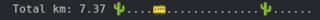

# railway-statusbar
Statusbar application which moves a train according to your typing speed.
Probably only supports X, and not Wayland.


Animated example:
 

## Requirements
Requires Python and python-xlib.


## Installation

1. Clone repo
2. Add railway.py script as a statusbar module:

### Polybar
Add as a polybar module:
```
[module/railway]
type = custom/script
exec = "/usr/bin/python3 -u ~/path/to/railway.py"
tail = true
interval = 10
```

### i3bar
tbd


## Known issues
- Might not keep still if your emoji scaling is off. This can be fixed in Polybar by scaling your emoji font, i.e. `font-1 = JoyPixels:scale=8`.


## Planned features
- Parallax effect
- Wayland support
- Persistent storage of total km-counter
